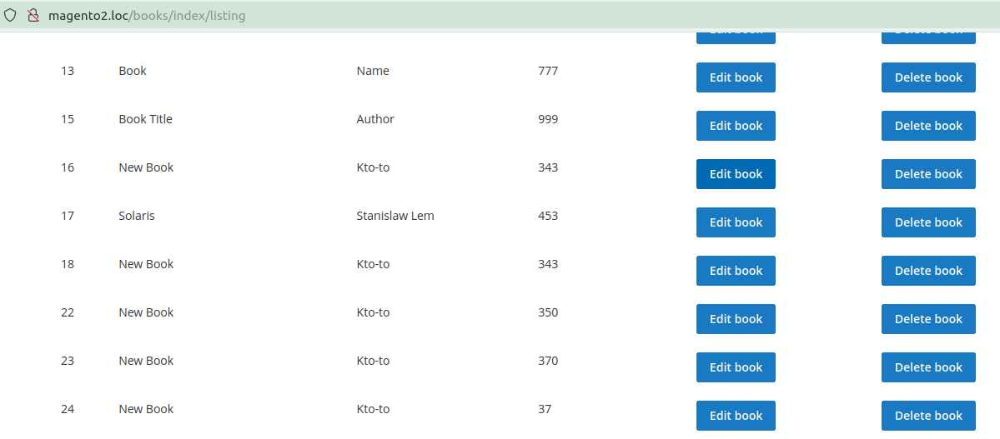
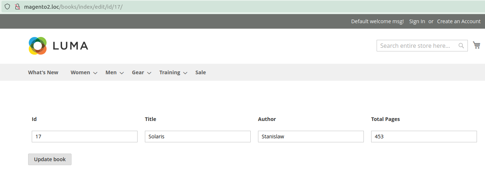
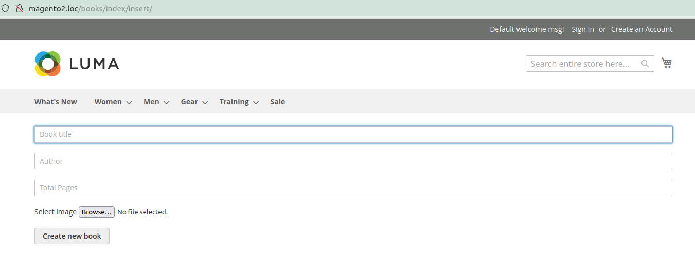

# Magento 2 Books CRUD Extension

This Magento 2 module implements CRUD.

As a user you can view all books



You can edit the selected book or delete it


You can add a new book


## Requirements
* Magento Community Edition 2.1.x-2.4.x or Magento Enterprise Edition 2.1.x-2.4.x

## Installation
* Download [ZIP Archive](https://github.com/nordraw/magento2-books-crud/archive/refs/heads/master.zip)
* Extract files
* In your Magento 2 root directory create folder app/code/Encomage/Books
* Copy files and folders from archive to that folder
* Run commands:
```
php bin/magento module:enable Encomage_Books
php bin/magento setup:upgrade
```

## Have questions?
Questions and wishes write to email:
nikita.tretyak093@gmail.com